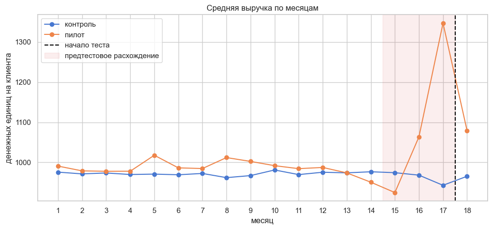
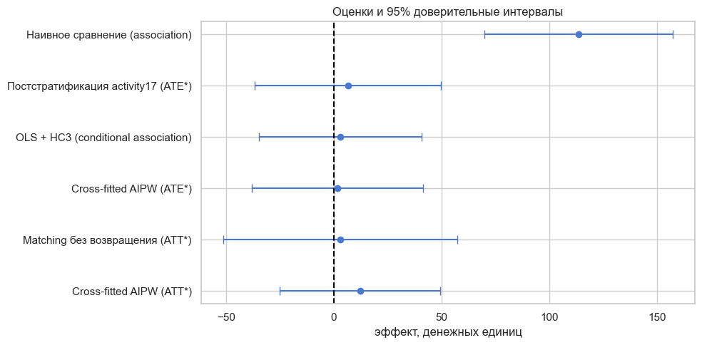

# Диагностика selection bias в A/B-тесте

Портфолио-проект по продуктовой аналитике и causal inference: проверка качества назначения в A/B-тесте, оценка смещения и анализ эффекта через постстратификацию, matching и cross-fitted AIPW.

> **Вердикт:** наивные `+11,8%` к выручке сопровождаются сильным предтестовым дисбалансом и не являются причинным эффектом кнопки. После поправки по наблюдаемой истории основной AIPW-ATE равен примерно `+0,2%` с 95% ДИ от `−3,9%` до `+4,3%`. Ожидаемые `+8–10%` не подтверждаются; для решения о раскатке нужен новый рандомизированный эксперимент.

[Открыть выполненный ноутбук](ab_test_selection_bias.ipynb)



## Бизнес-задача

Интернет-магазин изменил кнопку оплаты и ожидает рост выручки на 8–10%. В данных находятся 30 000 клиентов: 3 000 в пилоте и 27 000 в контроле. Необходимо проверить корректность эксперимента, оценить эффект и дать рекомендацию по раскатке.

Основной estimand — **ATE** для будущего раската на всех eligible-клиентов. Дополнительно оценивается **ATT** для аудитории, фактически выбранной в пилот. Если фактическая экспозиция кнопки неизвестна, это эффекты назначения — ITT.

## Почему наивному результату нельзя доверять

- split соответствует 10/90, но это не доказывает рандомизацию;
- пол и ОС сбалансированы, а предпериодное поведение — нет;
- в `month17` пилот тратил на 42,9% больше контроля ещё до запуска;
- доля активных в `month17`: 72,8% в пилоте против 51,9% в контроле;
- SMD активности в `month17` равен 0,442 при диагностическом пороге 0,10;
- placebo-тесты находят «эффекты» в `month15`–`month17`, когда кнопки ещё не было.

После обнаружения неслучайного назначения анализ рассматривается как observational study. Причинная интерпретация требует условной обмениваемости по наблюдаемым признакам, positivity, consistency/SUTVA и отсутствия ненаблюдаемых конфаундеров.

## Методы и результаты

| Метод | Estimand | Эффект | Относительно | 95% ДИ, абс. | Интерпретация |
|---|---|---:|---:|---:|---|
| Наивное сравнение | association | +113,6 | +11,8% | [69,9; 157,2] | смещено отбором |
| Постстратификация по активности | ATE* | +6,5 | +0,7% | [−36,8; 49,8] | прозрачная стандартизация |
| OLS с HC3 | conditional association | +3,0 | +0,3% | [−34,8; 40,9] | зависит от спецификации |
| Cross-fitted AIPW | ATE* | +1,7 | +0,2% | [−38,2; 41,6] | основная условная оценка |
| Matching без возвращения | ATT* | +3,2 | +0,3% | [−51,2; 57,5] | sensitivity-анализ |
| Cross-fitted AIPW | ATT* | +12,2 | +1,1% | [−25,1; 49,4] | эффект для пилотной аудитории |

`ATE*` и `ATT*` имеют причинную интерпретацию только при выполнении перечисленных допущений. Это разные целевые эффекты, поэтому их нельзя выдавать за несколько измерений одной величины.



## Что исправлено по сравнению с исходным решением

- ATE для раскатки отделён от ATT для участников пилота;
- дисперсия постстратифицированной оценки считается по размерам групп внутри страт;
- стандартные ошибки OLS сделаны робастными (`HC3`);
- CUPED не используется как способ исправить неслучайное назначение;
- основной AIPW использует пятифолдный cross-fitting без outcome leakage;
- добавлены overlap, propensity, ESS и Love plot;
- matching выполняется без возвращения, с exact-слоями и caliper;
- добавлены negative-control outcomes и воспроизводимый расчёт MDE;
- вывод «эффекта нет» заменён на корректный вывод об отсутствии подтверждения ожидаемого uplift;
- все числа получены полным чистым запуском ноутбука.

## Рекомендация бизнесу

Не раскатывать изменение на основании текущих данных. Перезапустить эксперимент со случайным назначением, заранее зафиксировать primary metric и MDE, проверить SRM и баланс до анализа результата. Для механики кнопки дополнительно измерять конверсию в оплату и время до оплаты.

При `α=0,05`, мощности 80% и split 3 000/27 000:

- raw MDE составляет около 6,36%;
- с OOF-CUPAC — около 5,45%;
- при split 50/50 и том же общем размере — около 3,27%.

Следовательно, будущий корректный месячный тест должен обнаружить ожидаемые 8–10%, если эффект действительно существует и допущения расчёта мощности выполняются.

## Структура репозитория

```text
.
├── ab_test_selection_bias.ipynb
├── data/
│   ├── README.md
│   └── ab_test_data.xlsx
├── reports/
│   └── figures/
│       ├── effect_estimates.png
│       └── pretrend.png
├── .gitignore
├── README.md
└── requirements.txt
```

## Запуск

```bash
python3 -m venv .venv
source .venv/bin/activate
pip install -r requirements.txt
jupyter nbconvert --to notebook --execute --inplace \
  --ExecutePreprocessor.timeout=600 ab_test_selection_bias.ipynb
```

Или откройте ноутбук интерактивно:

```bash
jupyter lab
```

Проект проверен на Python 3.10. Все 18 кодовых ячеек выполнены, сохранённых ошибок и widget-метаданных нет.

## Стек

Python, pandas, NumPy, SciPy, statsmodels, scikit-learn, Matplotlib, Seaborn, Jupyter.

## Данные и ограничения

Используется анонимизированный учебный датасет без персональных идентификаторов. Публичный первоисточник и лицензия не указаны, поэтому перед внешним распространением файла следует уточнить условия его использования. Денежная единица в исходном описании также не зафиксирована.
