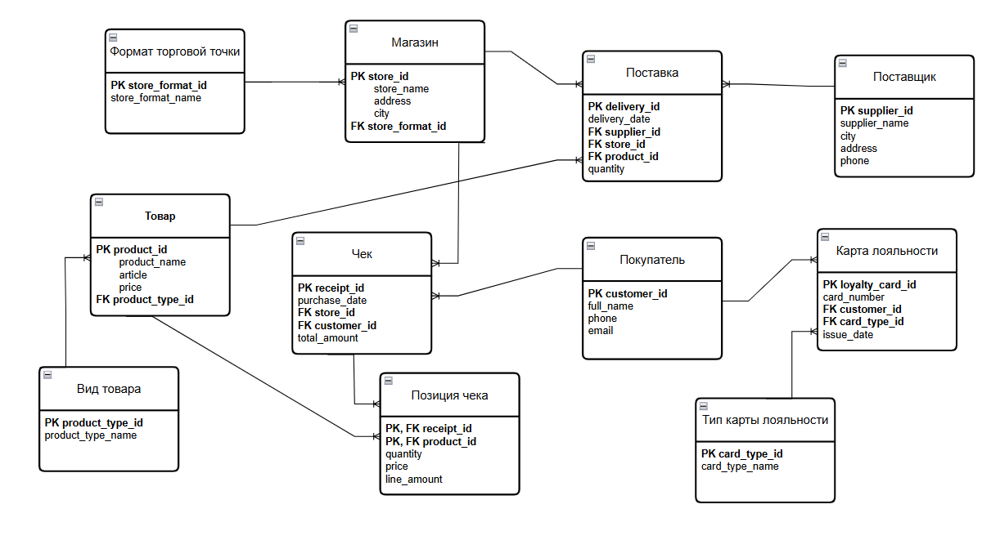

# SQL-аналитика и проектирование БД торговой компании

Проект реляционной базы данных для розничной торговой компании с данными о товарах, магазинах, покупателях, чеках, картах лояльности, поставщиках и поставках.

Реализованы **11 связанных таблиц, 8 аналитических SQL-запросов и 3 представления** для задач маркетинга, закупок и управленческой аналитики.

**Стек:** PostgreSQL, SQL  
**Проверка:** все скрипты успешно выполнены на PostgreSQL 18.4.  
**Данные:** демонстрационные.

## Бизнес-контекст

Торговой сети необходимо связывать данные о продажах, покупателях, ассортименте и поставках, чтобы отвечать на прикладные вопросы:

- какие товары продаются в конкретных магазинах;
- как покупательская активность связана с программой лояльности;
- какие товары пользуются наибольшим и наименьшим спросом;
- какие поставщики работают с конкретными товарами и магазинами;
- кто является лидером по объёму поставок;
- как отличаются продажи между торговыми точками.

Для решения этих задач спроектирована реляционная модель данных и реализован набор аналитических SQL-запросов.

## Реализация

В проекте подготовлены:

- модель данных со справочниками, первичными и внешними ключами;
- ограничения `UNIQUE`, `NOT NULL`, `CHECK`;
- связь чеков и товаров M:N через таблицу `ReceiptItem`;
- составной первичный ключ `(receipt_id, product_id)`;
- воспроизводимое заполнение базы демонстрационными данными;
- 8 аналитических запросов;
- 3 аналитических представления;
- CSV с фактическими результатами двух запросов.

## Модель данных



| Блок | Таблицы | Назначение |
| --- | --- | --- |
| Ассортимент | `Product`, `ProductType` | Товары, артикулы, цены и виды товаров |
| Торговые точки | `Store`, `StoreFormat` | Магазины, адреса, города и форматы |
| Покупатели | `Customer`, `LoyaltyCard`, `CardType` | Покупатели и принадлежащие им карты лояльности |
| Продажи | `Receipt`, `ReceiptItem` | Чеки и товарные позиции |
| Закупки | `Supplier`, `Delivery` | Поставщики и поставки товаров |

Цены и суммы хранятся в `DECIMAL(10,2)`. Цена товара в позиции чека может отличаться от его текущей цены в таблице `Product`, что позволяет хранить цену на момент покупки.

## Аналитические задачи

Все восемь основных запросов находятся в [`queries.sql`](queries.sql).

| № | Задача | Возможное применение |
| --- | --- | --- |
| 1 | Товары, продававшиеся в выбранном магазине | Анализ проданного ассортимента |
| 2 | Проданные товары с поставщиками из города магазина | Анализ локальных поставщиков |
| 3 | Покупатели с суммой покупок за месяц не выше заданного порога | Сегментация покупателей по расходам |
| 4 | Поставщики последней поставки товара по адресу магазина | Контроль последних поставок |
| 5 | Товары и поставщики в магазинах выбранного покупателя | Анализ ассортимента посещаемых торговых точек |
| 6 | Магазины, продававшие товар указанного поставщика | Сопоставление продаж и поставок |
| 7 | Самый популярный и самый непопулярный товары среди покупок владельцев карт лояльности за день | Анализ спроса внутри программы лояльности |
| 8 | До трёх ведущих поставщиков наименее частого в чеках товара за месяц | Анализ поставщиков и товарного спроса |

## Аналитические представления

В [`views.sql`](views.sql) реализованы три представления.

### `view_marketing_analytics`

Представление для анализа покупательской активности.

Содержит:

- идентификатор покупателя;
- ФИО;
- номер карты лояльности;
- тип карты;
- количество покупок;
- общую сумму покупок.

Может использоваться для анализа поведения покупателей и активности участников программы лояльности.

### `view_procurement_supplies`

Представление для закупочной аналитики.

Содержит:

- дату поставки;
- поставщика;
- город поставщика;
- товар;
- вид товара;
- магазин;
- город магазина;
- объём поставки.

Позволяет анализировать поставки в разрезе поставщиков, товаров и торговых точек.

### `view_executive_sales_summary`

Представление для управленческой аналитики.

Содержит:

- магазин;
- город;
- формат торговой точки;
- количество чеков;
- суммарную выручку.

Может использоваться для сравнения продаж между торговыми точками.

## Используемые SQL-конструкции

В проекте используются:

- многотабличные `JOIN`;
- `LEFT JOIN`;
- `DISTINCT`;
- `GROUP BY`;
- `HAVING`;
- агрегатные функции `SUM`, `COUNT`, `MAX`;
- CTE (`WITH`);
- коррелированный подзапрос `EXISTS`;
- `CASE`;
- оконная функция `ROW_NUMBER() OVER (...)`;
- `DATE_TRUNC`;
- `COALESCE`;
- `CREATE VIEW`;
- фильтрация с `WHERE`;
- сортировка с `ORDER BY`;
- ограничение результатов с `LIMIT`.

## Примеры анализа

### Анализ покупок владельцев карт лояльности

Запрос №7 определяет самый популярный и самый непопулярный товары среди покупок владельцев карт лояльности за выбранный день.

Для решения используются:

- CTE;
- `JOIN`;
- коррелированный `EXISTS`;
- `GROUP BY`;
- `SUM`;
- две оконные функции `ROW_NUMBER() OVER (...)`;
- `CASE`.

Сначала рассчитывается суммарное количество проданных единиц каждого товара среди покупателей, имеющих карту лояльности.

Затем товары ранжируются:

- по убыванию количества продаж — для определения самого популярного товара;
- по возрастанию количества продаж — для определения самого непопулярного товара.

На демонстрационных данных за **10 мая 2025 года**:

- `Milk 1L` — 5 проданных единиц;
- `Bread White` — 1 проданная единица.

Результат запроса сохранён в [`results/query7_results.csv`](results/query7_results.csv).

### Анализ поставщиков

Запрос №8 сначала определяет товар, который реже всего встречался в чеках за выбранный месяц.

После этого рассчитывается суммарный объём поставок этого товара по каждому поставщику и выбираются до трёх поставщиков с наибольшим объёмом.

Для решения используются:

- CTE;
- `COUNT(DISTINCT ...)`;
- `GROUP BY`;
- `ORDER BY`;
- `LIMIT`;
- `SUM`.

Такой запрос позволяет совместно анализировать товарный спрос и структуру поставок.

На текущем наборе демонстрационных данных запрос корректно выполняется, но возвращает пустой результат: выбранный как наименее частый товар `Yogurt Cherry` не имеет поставок в мае 2025 года.

### Анализ покупателей по расходам

Запрос №3 группирует покупки клиентов за выбранный месяц и рассчитывает суммарные расходы каждого покупателя.

Используются:

- `JOIN`;
- `DATE_TRUNC`;
- `SUM`;
- `GROUP BY`;
- `HAVING`.

Запрос позволяет выделять группы покупателей по уровню расходов.

### Анализ последних поставок

Запрос №4 находит последнюю дату поставки выбранного товара в конкретный магазин и определяет поставщиков, выполнявших поставку в эту дату.

Используются:

- CTE;
- `MAX`;
- несколько `JOIN`;
- фильтрация по товару и адресу магазина.

Это позволяет получать информацию о последних поставках выбранного товара.

## Запуск проекта

Для запуска необходим PostgreSQL и клиент `psql`.

### 1. Создание базы данных

```bash
createdb -U postgres retail_analytics
```

При необходимости вместо пользователя `postgres` укажите свою роль PostgreSQL.

### 2. Создание схемы и загрузка данных

```bash
psql -X -U postgres -d retail_analytics \
  -v ON_ERROR_STOP=1 \
  --single-transaction \
  -f schema.sql \
  -f seed.sql
```

Файл [`schema.sql`](schema.sql) создаёт структуру базы данных.

Файл [`seed.sql`](seed.sql) загружает демонстрационные данные.

Оба файла рассчитаны на однократный запуск в новой пустой базе.

### 3. Выполнение аналитических запросов

```bash
psql -X -U postgres -d retail_analytics \
  -v ON_ERROR_STOP=1 \
  -f queries.sql
```

Файл [`queries.sql`](queries.sql) содержит восемь основных аналитических запросов.

### 4. Создание аналитических представлений

```bash
psql -X -U postgres -d retail_analytics \
  -v ON_ERROR_STOP=1 \
  -f views.sql
```

После выполнения [`views.sql`](views.sql) в базе будут доступны:

- `view_marketing_analytics`;
- `view_procurement_supplies`;
- `view_executive_sales_summary`.

В pgAdmin можно создать базу и последовательно выполнить те же четыре файла через Query Tool.

## Результаты

Примеры фактических результатов запросов находятся в директории [`results/`](results/).

### `query1_results.csv`

[`query1_results.csv`](results/query1_results.csv) содержит товары, продававшиеся в магазине `Pyaterochka Center`.

На демонстрационных данных запрос возвращает 3 товара.

### `query7_results.csv`

[`query7_results.csv`](results/query7_results.csv) содержит результат анализа популярных и непопулярных товаров среди покупок владельцев карт лояльности.

На данных за 10 мая 2025 года:

- `Milk 1L` — 5 единиц;
- `Bread White` — 1 единица.

CSV-файлы сформированы непосредственно из результатов выполнения SQL-запросов в PostgreSQL.

## Особенности анализа

Проект использует демонстрационные данные, поэтому результаты предназначены для демонстрации структуры БД и SQL-аналитики.

При интерпретации запросов важно учитывать:

- наличие карты лояльности означает, что карта принадлежит покупателю, но не доказывает использование карты в конкретной покупке;
- в запросе №7 популярность определяется по количеству проданных единиц;
- в запросе №8 непопулярность определяется по числу чеков, в которых встречался товар;
- запросы №2, №5 и №6 связывают продажи и поставки по товару и магазину, но не связывают конкретную продажу с конкретной партией поставки;
- товары без продаж не участвуют в определении популярного или непопулярного товара;
- при равенстве показателей дополнительный порядок определяется идентификатором товара.

Более подробная информация о проверке воспроизводимости и ограничениях отдельных запросов находится в [`VALIDATION.md`](VALIDATION.md).

## Структура проекта

```text
sql-retail-analytics/
├── README.md
├── schema.sql
├── seed.sql
├── queries.sql
├── views.sql
├── er_diagram.png
├── VALIDATION.md
└── results/
    ├── query1_results.csv
    └── query7_results.csv
```

## Воспроизводимость

Проект проверен совместным запуском всех SQL-файлов в PostgreSQL 18.4.

Последовательно выполнялись:

```text
schema.sql
seed.sql
queries.sql
views.sql
```

В ходе проверки:

- создано 11 таблиц;
- загружено 59 строк демонстрационных данных;
- успешно выполнены все 8 аналитических запросов;
- созданы и прочитаны все 3 представления;
- нарушений ограничений базы данных не обнаружено;
- расхождений между суммой позиций и итоговой суммой чеков не обнаружено;
- CSV-файлы сформированы из фактических результатов SQL-запросов.

Подробности проверки и особенности данных описаны в [`VALIDATION.md`](VALIDATION.md).